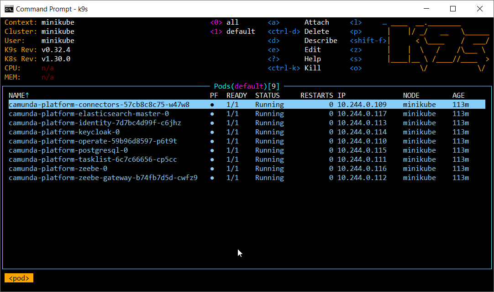
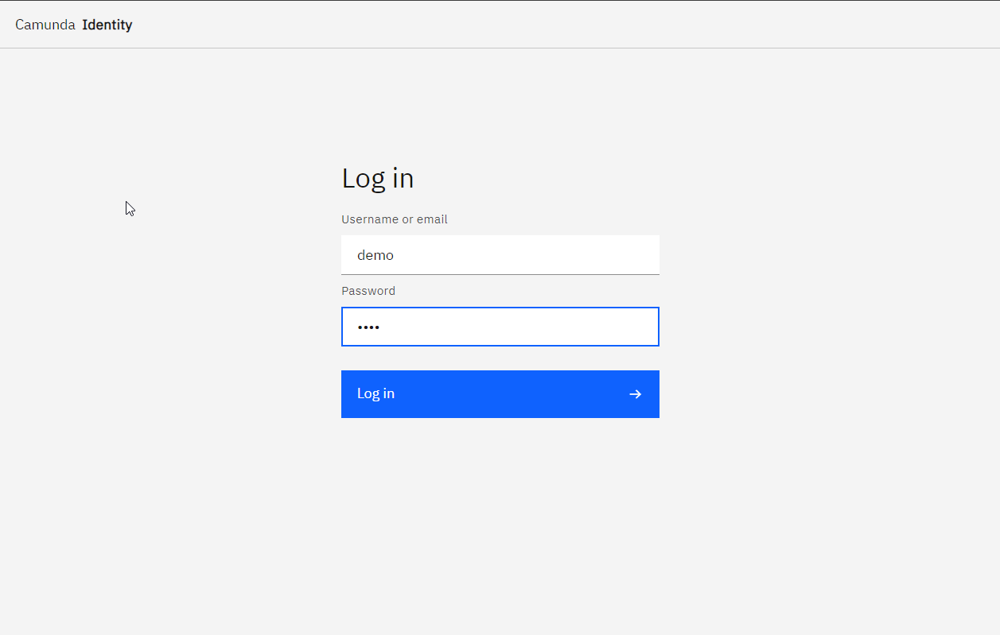
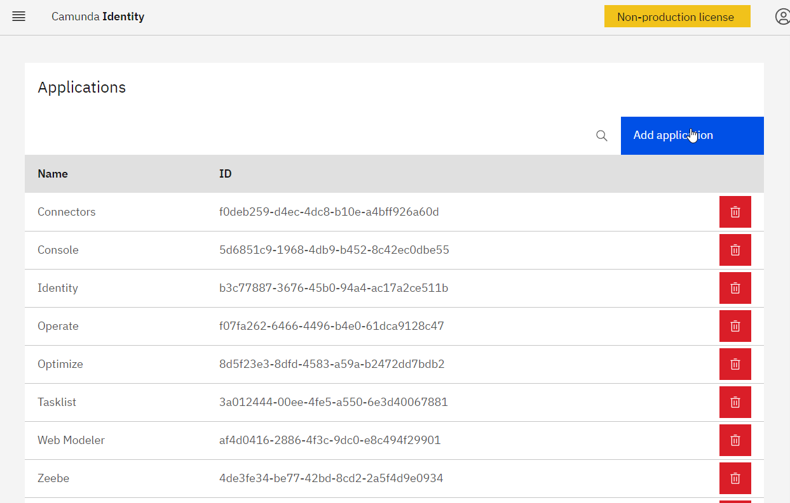
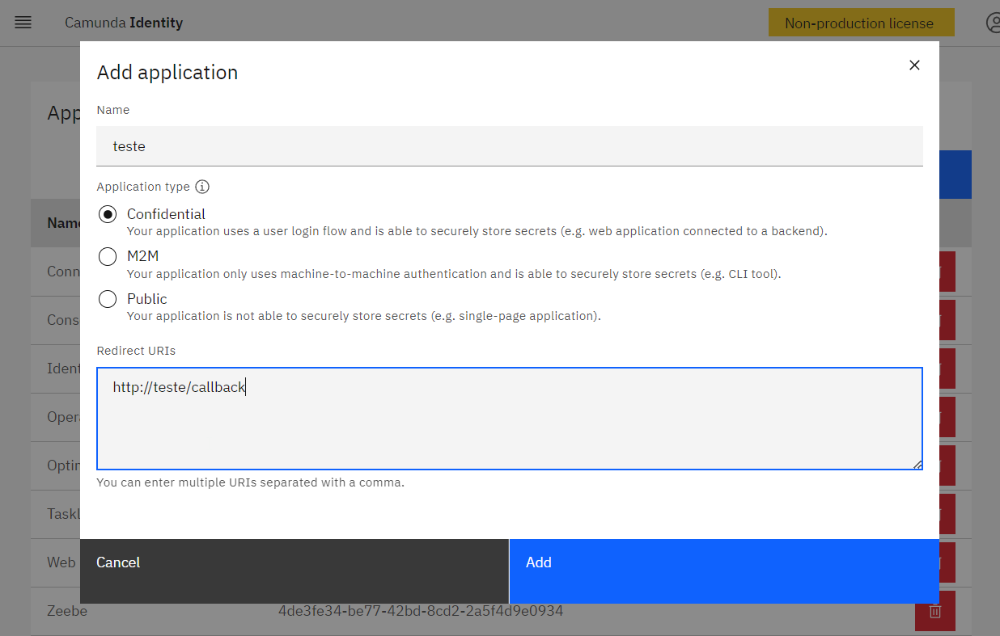
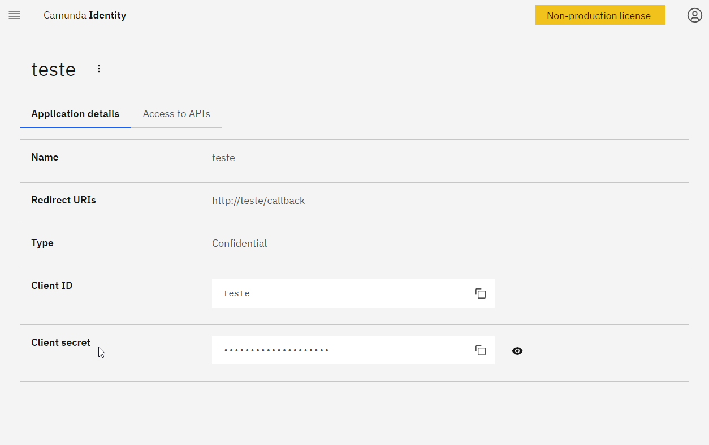
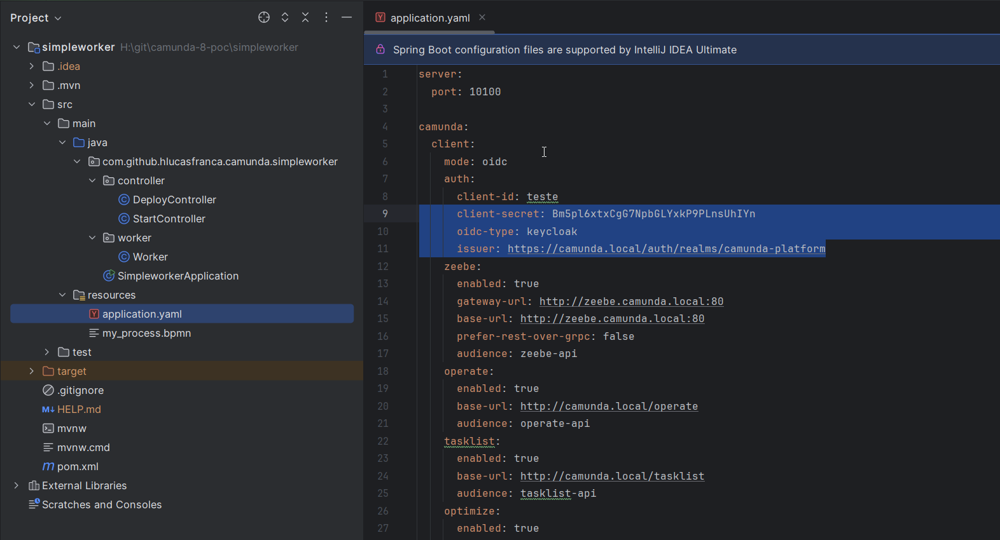
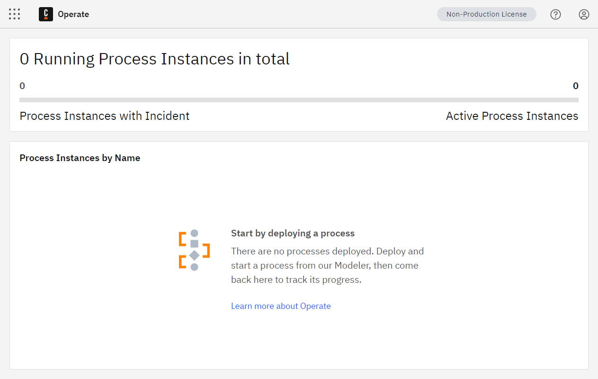
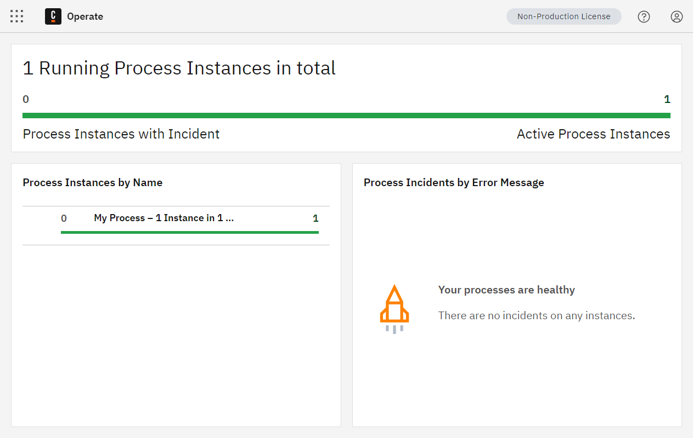
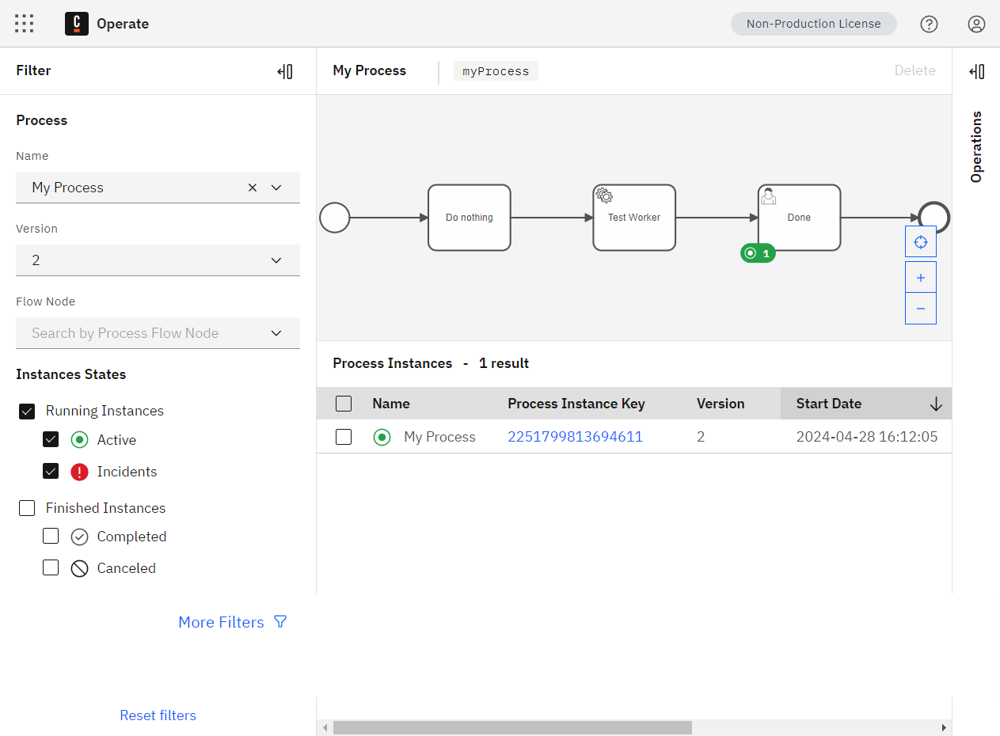

# Running a full Camunda 8 installation locally

## Prerequisite

- Docker/Podman;
- kubectl;
- minikube;
- helm;
- mkcert;
- k9s (optional).

## Starting minikube

```bash
minikube start

minikube addons enable ingress

minikube addons enable ingress-dns
```

## Adding 127.0.0.1 camunda.local to the hosts file

```bash
127.0.0.1 camunda.local
```

## Starting minikube's tunnel

```bash
minikube tunnel
```

## Adding Camunda's helm repo

```bash
helm repo add camunda https://helm.camunda.io
helm repo update
```

## Installing Camunda 8 using helm

```bash
helm install camunda-platform camunda/camunda-platform --version 10.0.2 -f helm/camunda-platform-core-kind-values.yaml
```



## Local certificate configuration

```bash
# install mkcert
choco install mkcert

mkcert camunda.local "*.camunda.local" localhost 127.0.0.1 ::1

kubectl -n kube-system create secret tls mkcert --key camunda.local+4-key.pem --cert camunda.local+4.pem
```

## Using the custom certificate in nginx ingress:

```bash
# https://minikube.sigs.k8s.io/docs/tutorials/custom_cert_ingress/
minikube addons configure ingress
-- Enter custom cert(format is "namespace/secret"): kube-system/mkcert

# Enable ingress addon (disable first when already enabled)
minikube addons disable ingress
minikube addons enable ingress

# Verify if custom certificate was enabled
kubectl -n ingress-nginx get deployment ingress-nginx-controller -o yaml | grep "kube-system" - --default-ssl-certificate=kube-system/mkcert
```
## Register the SimpleWorker on Identity

[https://camunda.local/identity](https://camunda.local/identity)









## Copy the credentials to the spring boot app



## Opening the Operate’s page

[https://camunda.local/operate](https://camunda.local/operate)



## Running the worker

On the `simpleworker` folder, run:

```bash

mvn spring-boot:run
```

## Deploying the companion BPMN

```bash
curl --request POST --url 'http://localhost:10100/deploy?bpmnName=my_process.bpmn'
```

## Starting a process instance

```bash
curl --request POST --url 'http://localhost:10100/start?id=myProcess'
```




